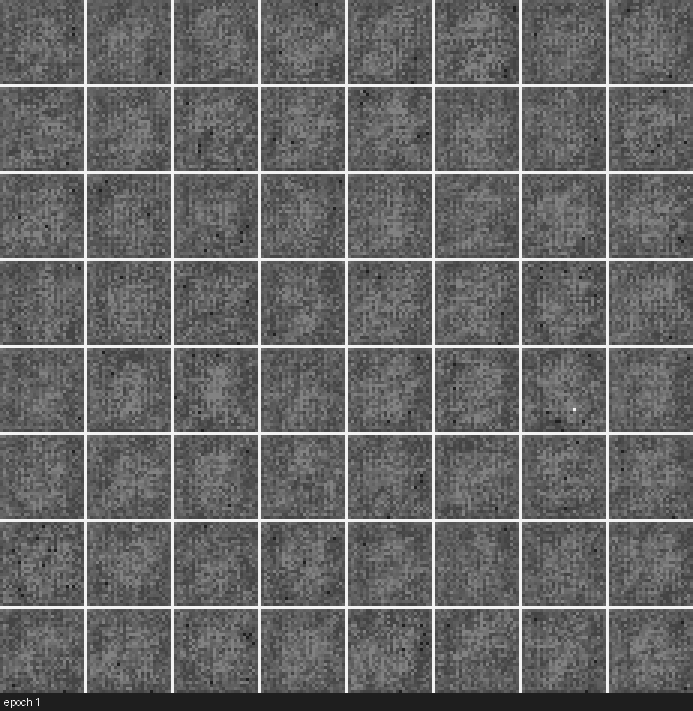
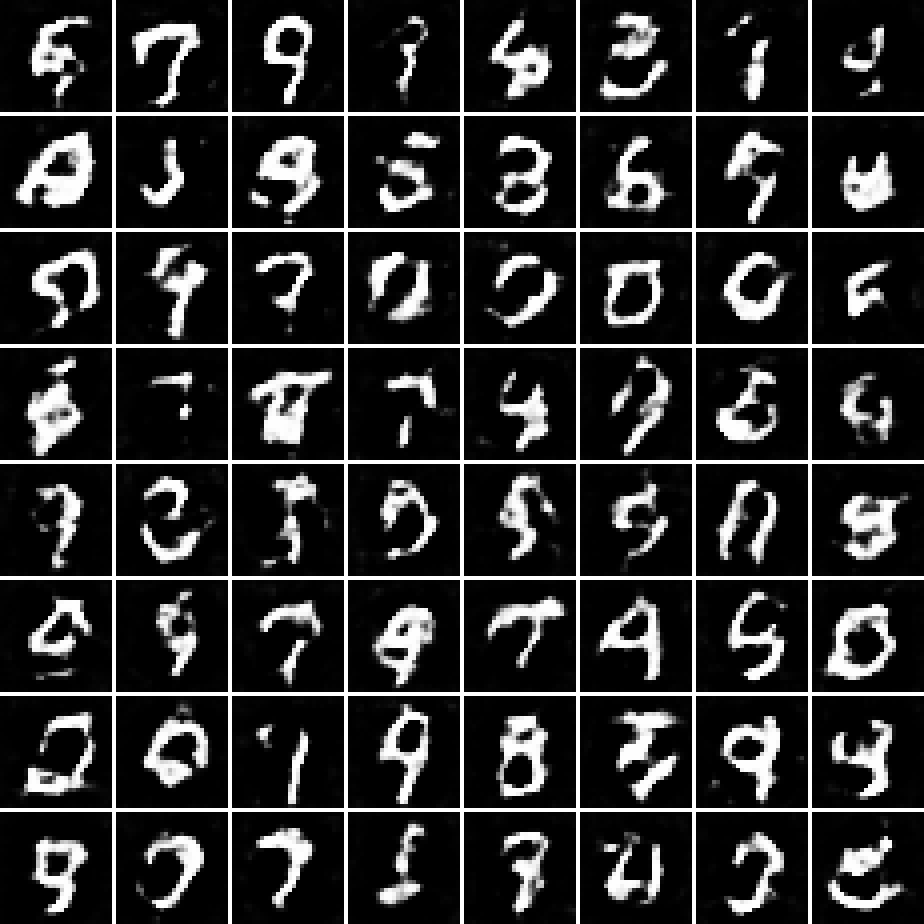
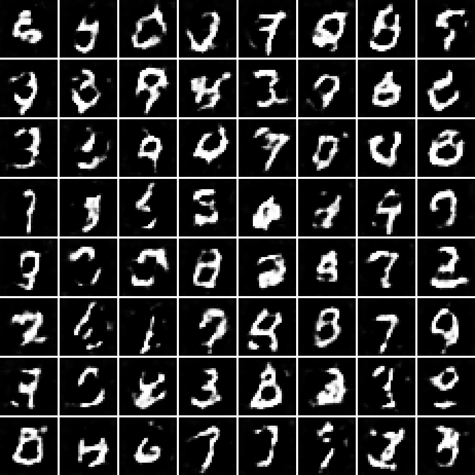

# gan-image-generation

A small DCGAN in PyTorch that learns to draw handwritten digits from noise. The
generator starts from static and, epoch by epoch, resolves a fixed batch of
random vectors into recognizable digits. That progression is the point of this
repo, so it leads the page.



Each frame above is the same 64 latent vectors decoded by the generator after a
given epoch, on MNIST. The images sharpen from noise to digit-like strokes as
adversarial training proceeds. The generator here is deliberately compact and
trained briefly on a CPU, so the final samples are legible rather than crisp.

## Sample it yourself, offline

The repo ships a pretrained generator at `models/generator.pt`. The quickstart
loads it and writes a fresh 8x8 grid. No dataset, no training, no network.

```bash
python -m venv .venv
.venv\Scripts\activate         # Windows, or: source .venv/bin/activate
pip install -e ".[dev]"        # add torch CPU wheel if needed, see below
python scripts/generate.py     # writes results/generated.png
```

Change the noise with `--seed`, the count with `--n`, or point `--weights` at
your own checkpoint. A grid produced this way looks like the examples below.

## Gallery

Two grids sampled from the committed generator with different noise seeds. These
are generated images, not dataset digits, so nothing here redistributes MNIST.

| seed 1 | seed 2 |
| --- | --- |
|  |  |

## How it works

- A generator maps a latent vector to a 1x28x28 image through transposed
  convolutions with batch norm, ReLU, and a Tanh output. A discriminator maps an
  image to a single real/fake logit through strided convolutions with LeakyReLU.
  Both follow the DCGAN design rules but are written from scratch and sized for
  28x28 grayscale rather than 64x64.
- They train together with the non-saturating GAN loss and the Adam settings
  from the DCGAN paper, on images scaled to [-1, 1] to match the Tanh output.
- After every epoch the generator decodes a fixed batch of noise. Those
  snapshots become the training GIF, and the final generator is saved as a small
  checkpoint for instant sampling.

## Retrain and rebuild the GIF

Training pulls MNIST or Fashion-MNIST through torchvision on first use, then
writes the GIF, loss curves, example grids, a metrics file, and the generator.

```bash
python scripts/download_data.py --root data --dataset mnist   # optional prefetch
python scripts/train.py --dataset mnist --epochs 25 --subset 6000
```

Per-epoch generator checkpoints land in `checkpoints/` (gitignored) and the
regenerated hero GIF overwrites `assets/training.gif`. On Linux CI, install the
CPU build of PyTorch first: `pip install torch torchvision --index-url
https://download.pytorch.org/whl/cpu`. Requires Python 3.11 or newer.

## What the numbers say

Measured this session by `python scripts/train.py --dataset mnist --epochs 25
--subset 6000`: a DCGAN with a narrow generator (ngf 32), batch size 128, single
seed, on a 6000-image MNIST subset, on a CPU, in about three and a half minutes.
Full history is in `results/metrics.json`.

GAN losses are not accuracy and lower is not better. What matters is that the two
networks stay in balance rather than one collapsing. Across the 25 epochs the
discriminator loss stayed in roughly 0.20 to 0.62 and the generator loss in
roughly 1.94 to 2.89, with neither running to zero. Final values were
discriminator 0.339 and generator 2.309. That stable equilibrium, visible in
`assets/losses.png`, is the sign of healthy adversarial training.

Sample quality is honest for the budget. By the final epoch a clear majority of
the 64 samples are recognizable digits, with a minority still malformed or
ambiguous. A wider generator, the full dataset, and longer training sharpen the
output further, at the cost of the couple-of-minutes CPU runtime this demo is
built around.

## What it does not do

- No FID or Inception Score. Quality is shown qualitatively through the grids and
  the GIF, not scored with a pretrained metric network.
- No conditional generation, no progressive growing, no high-resolution images.
  The demo targets 28x28 digits so it trains on a CPU in minutes.
- No stability tricks beyond the DCGAN recipe: no spectral norm, no gradient
  penalty, no two-timescale update rule.

## Layout

```
assets/             hero training.gif and losses.png
examples/           generated digit grids (grid_1.png, grid_2.png)
models/             generator.pt, the committed pretrained generator
results/            metrics.json plus generated grids (mostly gitignored)
src/dcgan/          library: models, data, trainer + checkpointing, visualize
scripts/            generate.py (offline quickstart), train.py, download_data.py
notebooks/          demo.ipynb with executed outputs
tests/              pytest suite, runs on random tensors offline
data/               gitignored, MNIST downloaded on demand
```

## Tests

```bash
pytest -q
```

The suite runs fully offline on random tensors: it checks output shapes, the
Tanh range, a single training step, checkpoint save and load round-trips, and
that the grid and GIF writers produce files.

## References

- Radford, Metz, Chintala, Unsupervised Representation Learning with Deep
  Convolutional Generative Adversarial Networks, 2016 (DCGAN).
- Goodfellow et al., Generative Adversarial Nets, 2014.

## Author

Aamir Malik

- GitHub: https://github.com/aamirmalik-dr
- LinkedIn: https://linkedin.com/in/dr-aamirmalik

## License

MIT, see LICENSE.
